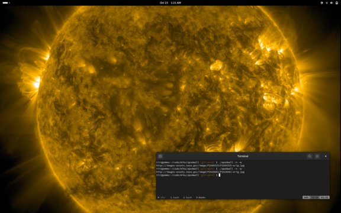

# apodwall

APOD wallpaper fetcher and wallpaper switcher. Inspired by
[nasa-wallpaper](https://github.com/davidpob99/nasa-wallpaper), mostly written
by claude.

```
$ go install github.com/miku/apodwall@latest
```

## Usage

```
 $ apodwall -h
Usage of apodwall:
  -T duration
        HTTP request timeout (default 30s)
  -a    Display APOD (Astronomy Picture of the Day) image URL
  -n    Display random NASA image URL
  -q string
        Search query for NASA images (default "sun")
  -w    Set the image as wallpaper (downloads and caches the image)
```

## Sunshine



